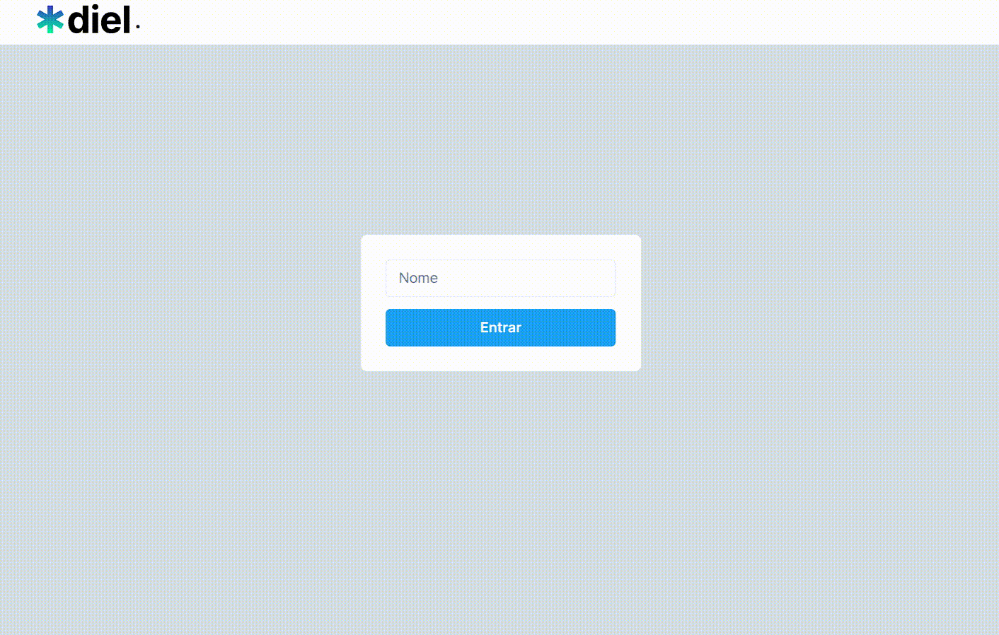

<h1 align="center">
 
  Calendário de Tarefas
 
</h1>
<h2>
Passos para rodar o projeto:
</h2>

  Aperte o botão "Code" acima para clonar o projeto para seu computador.  
  Após fazer o clone para seu computador, Recomendo usar a versão 16.14.0 do <a href="https://nodejs.org/en/" alt="Link para a instalaçao do Node" target="_blank">Node</a>, instale diretamente no site do Node ou altere usando o <a href="https://github.com/nvm-sh/nvm#installing-and-updating" alt="link para a instalação do NVM" target="_blank">Nvm</a> . 
  Acesse a pasta do projeto e para rodar o Back-end, faça os seguintes passos: 1 - cd BackTaskList; 2 - npm i; 3 - npm run dev.  
  Agora para rodar o Front-end, faça os seguintes passos: 1 - cd FrontTaskList; 2 - npm i; 3 - npm run dev.  
  Pronto, agora só acessar no navegador o seguinte endereço: http://localhost:5173

  

    

## Tecnologias

O projeto foi desenvolvido com as seguintes Tecnologias:

- React
- Typescript
- Context API
- Chakra UI
- Apex Charts
- Axios
- Node com Express
- UUID

---

Feito por Matheus Bezerra, entre em contato pelo Linkedin --> <a href="https://www.linkedin.com/in/matheus-bezerra04/">Matheus-Bezerra04</a>

Ou entre em contato pelo Numero (11) 97661-1929

